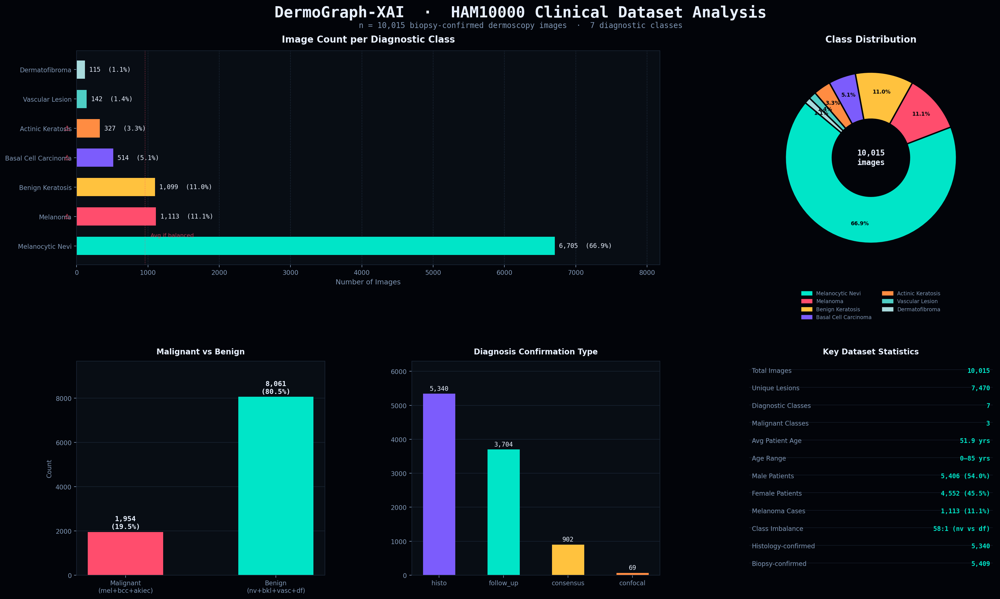
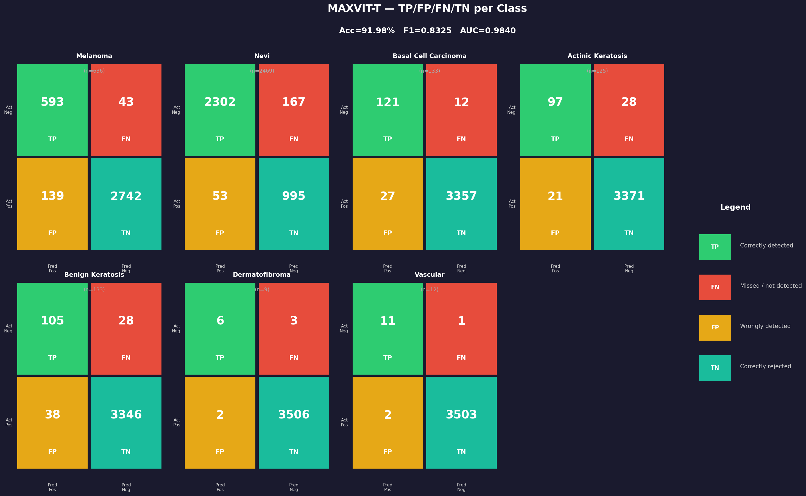
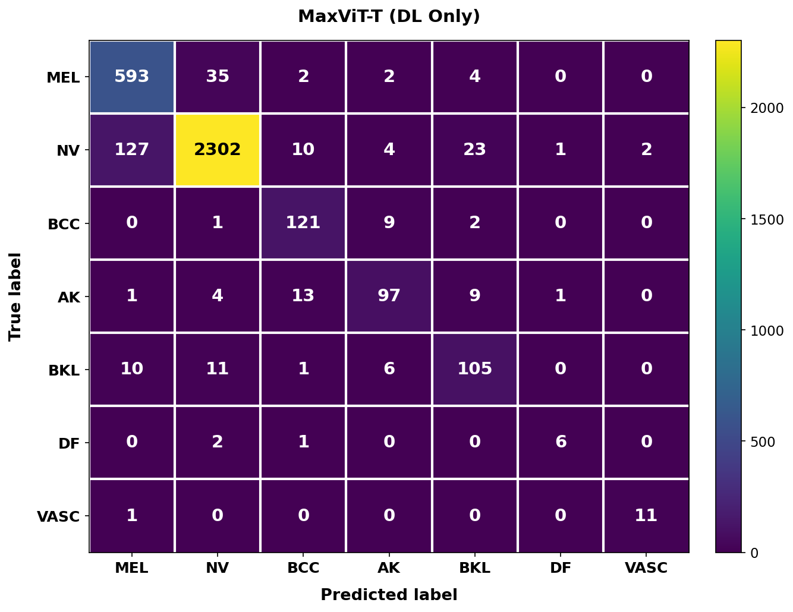
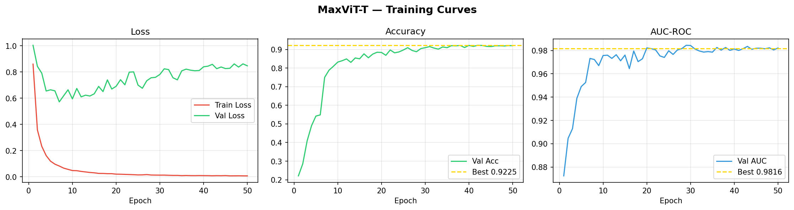
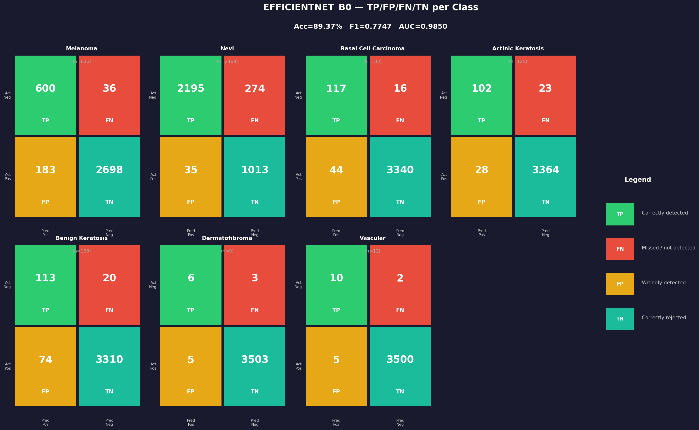
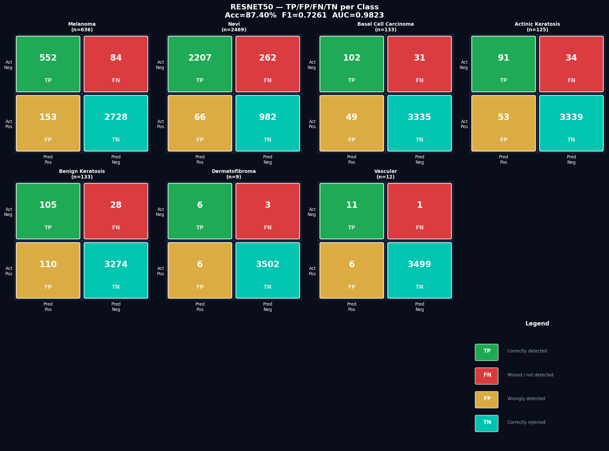
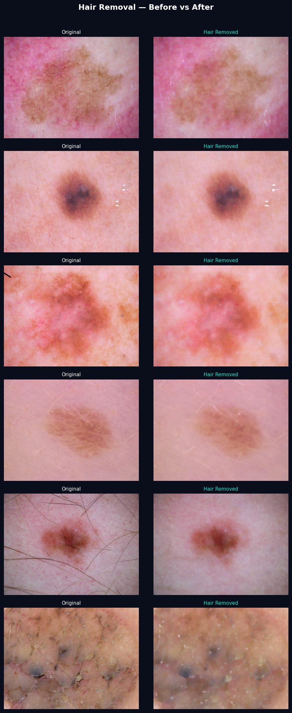
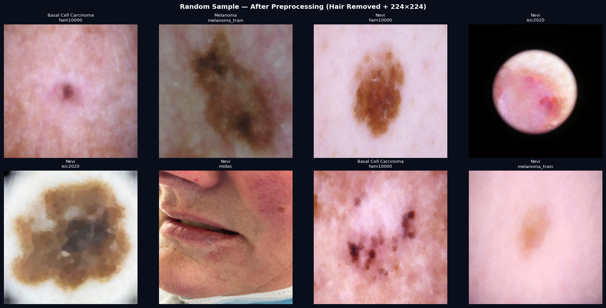

# DermoGraph-XAI 🔬

> **Multi-Dataset Skin Lesion Classification with Explainable AI**  
> Team 8 | VIT Bhopal | B.Tech Final Year Project

[](https://python.org)
[](https://pytorch.org)
[](https://www.kaggle.com/akshat23029)
[](LICENSE)

---

## 📌 Overview

DermoGraph-XAI is a comprehensive deep learning framework for automated skin lesion classification across **7 diagnostic categories**. The system benchmarks **12+ CNN and transformer architectures** and introduces **DermoNet** — a novel hybrid architecture combining dual-scale CNNs, Lesion-Aware Attention Gates (LAAG), and Multi-Resolution Transformer Blocks (MRTB).

### 7-Class Classification
| Class | Label | Description |
|---|---|---|
| Melanoma | 0 | Malignant melanocytic tumor |
| Nevi | 1 | Benign melanocytic nevus |
| Basal Cell Carcinoma | 2 | Most common skin cancer |
| Actinic Keratosis | 3 | Precancerous lesion / SCC |
| Benign Keratosis | 4 | Seborrheic keratosis |
| Dermatofibroma | 5 | Benign fibrous nodule |
| Vascular | 6 | Vascular lesion |

---

## 📊 Benchmark Results

| Model | Accuracy | F1 Macro | AUC-ROC | Params | Time |
|---|---|---|---|---|---|
| VGG16 | 80.48% | 0.7102 | 0.9601 | 138M | — |
| MobileNetV2 | 83.74% | 0.7334 | 0.9805 | 3.4M | 57 min |
| ResNet50 | 87.40% | 0.7261 | 0.9823 | 25M | 110 min |
| DenseNet121 | 87.69% | 0.7663 | 0.9866 | 8M | 121 min |
| EfficientNet-B0 | 89.37% | 0.7747 | 0.9850 | 5.3M | 83 min |
| **MaxViT-T** | **91.98%** | **0.8325** | **0.9840** | 31M | 374 min |
| **DermoNet (ours)** | 🔄 | — | — | ~18M | — |

> All models trained on the same 6-dataset corpus (35,084 images) with identical augmentation, WeightedRandomSampler, and AdamW + CosineAnnealingLR setup for fair comparison.

---
## 📊 Results

### Class Distribution


### Best Model — MaxViT-T (91.98%)


### MaxViT-T Confusion Matrix


### MaxViT-T Training Curves


### EfficientNet-B0 (89.37%)


### ResNet50 Baseline


### Hair Removal Pipeline


### Sample Dataset Images


## 🗃️ Datasets

All datasets are hosted on Kaggle. Download and add them as inputs to your Kaggle notebook.

### Core Training Datasets (6 datasets — 35,084 images)

| Dataset | Images | Classes | Kaggle Link |
|---|---|---|---|
| HAM10000 | 10,015 | 7 | [dermograph-ham-images](https://www.kaggle.com/datasets/akshat23029/dermograph-ham-images) |
| ISIC 2020 | 8,757 | 2 | [dermograph-isic2020](https://www.kaggle.com/datasets/akshat23029/dermograph-isic2020) |
| PAD-UFES-20 | 2,298 | 6 | [dermograph-pad-images](https://www.kaggle.com/datasets/akshat23029/dermograph-pad-images) |
| Melanoma Cancer | 10,605 | 2 | [dermograph-melanoma-cancer](https://www.kaggle.com/datasets/akshat23029/dermograph-melanoma-cancer) |
| MIDAS | 3,411 | 7 | [dermograph-midas](https://www.kaggle.com/datasets/akshat23029/dermograph-midas) |
| Train/Val/Test Splits | — | — | [dermograph-splits](https://www.kaggle.com/datasets/akshat23029/dermograph-splits) |

### Extended Datasets (for Innovation Modules)

| Dataset | Images | Purpose | Kaggle Link |
|---|---|---|---|
| FitzPatrick17k | 16,577 | Fairness MTL (skin tone I–VI) | [dermograph-fitzpatrick](https://www.kaggle.com/datasets/akshat23029/dermograph-fitzpatrick) |
| Derm7pt | 1,011 | ABCDE Branch (7-point checklist) | [dermograph-derm7pt](https://www.kaggle.com/datasets/akshat23029/dermograph-derm7pt) |

### Dataset Split Statistics

```
Total images : 35,084
Train split  : 28,056  (80%)
Val split    :  3,511  (10%)
Test split   :  3,517  (10%)

Class distribution (test set):
  Melanoma            :   636
  Nevi                : 2,469
  Basal Cell Carcinoma:   133
  Actinic Keratosis   :   125
  Benign Keratosis    :   133
  Dermatofibroma      :     9
  Vascular            :    12
```

---

## 🏗️ Project Structure

```
DermoGraph-XAI/
├── notebooks/
│   ├── VGG16_DermoGraph.ipynb
│   ├── ResNet50_DermoGraph.ipynb
│   ├── DenseNet121_DermoGraph.ipynb
│   ├── MaxViT_DermoGraph_v2.ipynb
│   ├── MobileNetV2_DermoGraph.ipynb
│   ├── EfficientNet_B0_DermoGraph.ipynb
│   ├── EfficientNet_B3_DermoGraph.ipynb
│   ├── EfficientNetV2_S_DermoGraph.ipynb
│   ├── ConvNeXt_Small_DermoGraph.ipynb
│   ├── Swin_T_DermoGraph.ipynb
│   ├── ViT_B16_DermoGraph.ipynb
│   ├── ResNeXt50_DermoGraph.ipynb
│   ├── DenseNet169_DermoGraph.ipynb
│   ├── RegNetY_8GF_DermoGraph.ipynb
│   └── DermoNet_v2.ipynb          ← Novel architecture
├── dermograph_output/             ← Training results, plots
├── hair_removal_pipeline.py       ← 7-stage preprocessing
├── dataset_loader.py
├── preprocessing.py
└── README.md
```

---

## 🚀 Quick Start

### 1. Clone the repo
```bash
git clone git@github.com:akshat440/DermoGraph-XAI.git
cd DermoGraph-XAI
```

### 2. Set up environment
```bash
python -m venv venv
source venv/bin/activate
pip install torch torchvision timm albumentations einops scikit-learn opencv-python pandas matplotlib seaborn tqdm
```

### 3. Run on Kaggle
1. Create a new Kaggle notebook
2. Add all datasets from the links above via **+ Add Input**
3. Upload the desired notebook from `notebooks/`
4. Enable GPU (T4 × 2 recommended)
5. Run all cells

---

## 🧠 DermoNet — Novel Architecture

DermoNet is our proposed architecture trained from scratch, combining three novel components:

### Component 1: DualScaleStem
```
Fine branch   (3×3 conv) → captures hair follicles, fine texture
Coarse branch (7×7 conv) → captures lesion boundary, overall shape
Learned softmax fusion weights → adapts per image
```

### Component 2: Lesion-Aware Attention Gate (LAAG)
```
Channel attention → WHICH features matter (color shift = melanoma)
Spatial attention → WHERE to look (borders = BCC, center = DF)
Border enhancement → depthwise conv highlights lesion edges
Inspired by ABCDE dermoscopy criteria
```

### Component 3: Multi-Resolution Transformer Block (MRTB)
```
Fine scale   (full resolution)  → local texture details
Mid scale    (1/4 resolution)   → intermediate patterns
Coarse scale (1/16 resolution)  → global lesion structure
Cross-scale attention fusion    → fine features inform coarse decisions
Learned scale weights           → adaptive per layer
```

---

## ⚙️ Training Configuration

All baseline models use identical settings for fair comparison:

```python
BATCH_SIZE   = 32
N_EPOCHS     = 50
PATIENCE     = 15
OPTIMIZER    = AdamW(lr=1e-4, weight_decay=1e-2)
SCHEDULER    = CosineAnnealingLR(T_max=50, eta_min=1e-6)
LOSS         = CrossEntropyLoss(weight=class_weights)
SAMPLER      = WeightedRandomSampler
AMP          = FP16 mixed precision
IMAGE_SIZE   = 224×224
```

### Augmentation Pipeline
```python
RandomRotate90, Rotate(±180°), HorizontalFlip, VerticalFlip,
ColorJitter, GaussianBlur, CoarseDropout
```

---

## 📈 Innovation Modules (In Progress)

| Module | Description | Status |
|---|---|---|
| ABCDE Branch | 7-point checklist feature extraction using Derm7pt | 🔄 In Progress |
| GAT Pattern Graph | Graph Attention Network for lesion pattern relationships | 📋 Planned |
| Neural ODE | Continuous-depth modeling for lesion evolution | 📋 Planned |
| Fairness MTL | Multi-task learning for skin tone fairness (FitzPatrick I–VI) | 📋 Planned |

---

## 📋 Requirements

```
Python      >= 3.10
PyTorch     >= 2.0
timm        >= 0.9
albumentations
einops
scikit-learn
opencv-python
pandas
matplotlib
seaborn
tqdm
```

---

## 👥 Team

**Team 8 — VIT Bhopal**
- B.Tech Final Year Project
- Department of Computer Science

---

## 📄 Citation

If you use this work, please cite:
```bibtex
@misc{dermographxai2026,
  title   = {DermoGraph-XAI: Multi-Dataset Skin Lesion Classification with Explainable AI},
  author  = {Team 8, VIT Bhopal},
  year    = {2026},
  url     = {https://github.com/akshat440/DermoGraph-XAI}
}
```

---

## 📜 License

This project is licensed under the MIT License — see [LICENSE](LICENSE) for details.

> **Disclaimer:** This system is intended for research purposes only and is not a substitute for professional medical diagnosis.
